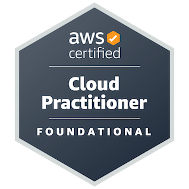

# 👋 Olá! Eu sou o Gabriel Bressane

## 🚀 Sobre mim

🎓 Estudante de **Sistemas de Informação**

🌱 Atualmente estudando **Python (Pandas), SQL, Power BI, C, Orientação a Objetos, Banco de Dados e Estruturas de Dados**

---

## 🛠️ Linguagens de Programação

    
    
    
    
    
    
    
    
    

---

## 📊 Ciência de Dados & BI

    
    
    

---

## ⚙️ Ferramentas e Plataformas

    
    
    
    

---

## 📊 Estatísticas do GitHub

    
    

---

## 🌟 Projetos

---

## 🐍 Contribuições

    

---

## 🏆 Certificações

    

    <b>AWS Certified Cloud Practitioner</b>  

---

## 🌐 Contato

    

