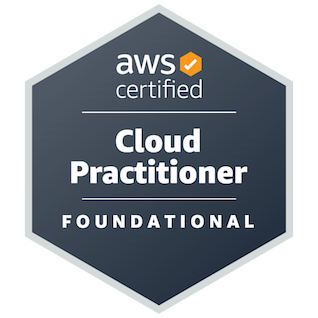

# 👋 Olá! Eu sou o Gabriel Bressane

## Sobre mim

Estudante de **Sistemas de Informação**

Atualmente estudando **Python (Pandas), SQL, Power BI, C, Orientação a Objetos, Banco de Dados, Typescript e Estruturas de Dados**

---

## Linguagens de Programação

    
    
    
    
    
    
    
    
    

---

## Ciência de Dados & BI

    
    
    
    
    

---

## Ferramentas e Plataformas

    
    
    
    

---

<h3> Estatísticas do GitHub </h3>

    
    

<b>Nota:</b> Top Languages é apenas uma métrica das linguagens meu código público e não reflete experiência ou nível de habilidade.

<h3> Projetos </h3>

    
    
    
    
    
    
    
    
    

---

## Contribuições

    

---

## Certificações

    
    

    <b>AWS Certified Cloud Practitioner</b> &nbsp;&nbsp;&nbsp; <b>AI Practitioner</b>

---

## Contato

    

